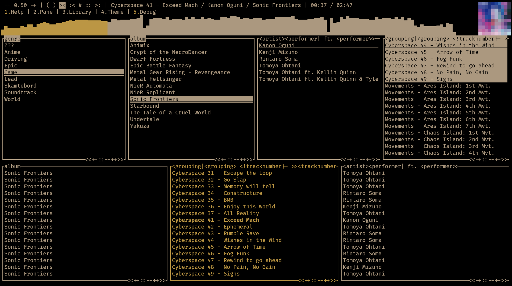

# OMPL - Opinionated Music Player/Library v 0.4.1
A music player organized exactly how *I* like it.

## Features
  * Fully functional TUI with mouse & tty support
    * Filter and sort tags however you want. See [Tagstrings](https://github.com/Beinsezii/ompl#tagstrings)
  * Fully functional CLI that interacts either with the TUI or a daemon
    * Both playback controls and content querying
    * Should be possible to do everything through the TUI in the CLI and vice versa
      * Some WIP areas present
  * Support for audio formats present in [rodio](https://github.com/RustAudio/rodio) [".mp3", ".flac", ".ogg", ".wav"]
    * Supports all [ID3v2 tags/frames](https://id3.org/id3v2.3.0#Declared_ID3v2_frames). You may sort by either the 4-character codes or the common names that I definitely didn't just make up on the spot. See [here for the common names](./src/library/track/mod.rs#L18)
    * Utilizes ReplayGain track (not album) tags
  * Pure Rust where possible. *Should* be portable.
  * Interfaces as a media player for Linux MPRIS, Windows, and MacOS[untested]
  * Very fast - Handle a few thousand files effortlessly on a shitty 2006 acer laptop with a failing harddisk
    * Memory usage something like a few MBs
  * Shouldn't crash.

## WIP/Why this isn't 1.0 yet
  * Full theme customization
  * Code docs
  * Some bugfix bs
  * See [TODO.md](./TODO.md) for more details
  
## Usage

Either download a binary from the tags/releases tab or if you already have Rust installed, run `cargo install --git https://github.com/Beinsezii/ompl.git`.
It is recommended you add the downloaded binary or cargo install dir to your `PATH` for ease of use.

To start a simple example sorting by album run `ompl -l Path/To/Music -f album`

To update the running program filters to genres "Epic" and "Game" while sorting results by album then title, run `ompl -f genre=Epic,Game -s album title`

To start a *new* TUI if you want two songs playing at once like a crackhead, run `ompl -l Path/To/Music --port 12345` or whatever valid port # you want.
Be careful to avoid commonly used ports such as 80, as other programs may be occupying these sockets.

To view a full list of commands for both the server (main instancce) and client, run ompl --help

### Tagstrings
OMPL can sort by literal tags or "tagstrings", a special markup language for creating 'presentable' strings given the presence or lack of specific tags.

 * To simply filter by a single tag, you may type it literally: `album` will result in "Album"
 * To sort by multiple tags in one filter, use angle brackets like you would other markup language tags:`<genre> <album>` will result in "Genre Album"
 * To check for a tag's existence, use a vertical bar separating what you wish to display: `<album|<album> - ><title>` will result in "Album - Title" if the `album` tag is present, or "Title" if no album tag is present
 * To check for a tag's absence, add an exclamation after the first bracked: `<album|<album>><!album|<title>>` will result in "Album" if the `album` tag is present, or "Title" if no album tag is present.

Extra syntactical notes:
 * `???` will be the result if a non-conditional tag such as `<tag>` isn't found. Use a condition if you don't wish to display this: `<tag|<tag>><!tag|Tag not found!>`
 * Use `\` to escape characters: `\<title\>: <title>` will result in "<title>: Title"
 * The algorithm will recursively  process down every set of angle brackets. This allows you to have checks inside checks `<tag|<tag2|<tag3>>>` but also has the side effect that `<<title>>` will result in a song titled "SongName" printing out "???", as it will first process `<<title>>` into `<SongName>`, *then* process `<SongName>` which likely won't be a valid tag, resulting in "???". Use escape `\` to prevent this if undesired.
 

### Compiling
Have Rust 2021 installed, clone repo and just run `cargo build`.
`build_bin.sh` will build in binaries in release mode for linux/windows, moving the binaries to ./bin/

## F.A.Q.
Question|Answer
---|---
Can you add support for my strange and unusual use-case?|Use [quodlibet](https://quodlibet.readthedocs.io/en/latest/) or [foobar2000](https://www.foobar2000.org/). This player is *mine*, not yours.
Can you change X functionality to be more like existing standards?|File a bug report with a good reason and I'll *consider* it.
Why are you so passive-aggressive?|I'm lonely.
